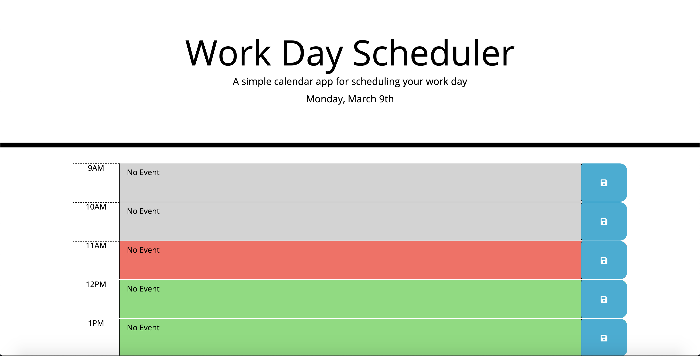

# day-planner
 
 ## Summary
 With this day planner, the user the has the ability to have a daily planner and save events to local storage. This uses moment js to get the current date and time. With the use of moment js, the code is able to know if it's a new day for the user so that it may reset the events in local storage but if the user comes back the same day all events are still saved in local storage. If the current time is past the event time the event will shade out. If the event is currently going on the event turns red and if the event is in the future the event will be green.

 ## Deployed Webpage

Link to webpage: [day-planner](https://alex-bailon.github.io/day-planner/)

Below are screenshots of webpage: 

## Summary
With the use of moment js and jquery, I was able to make a day planner that would create the html for the time blocks automatically. Future goals for this project would be to give the user the ability to select a date.